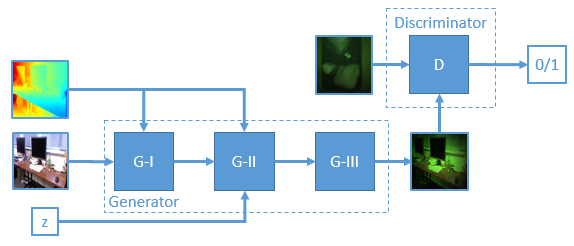
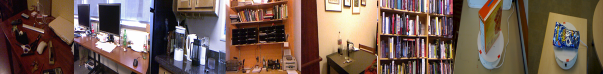
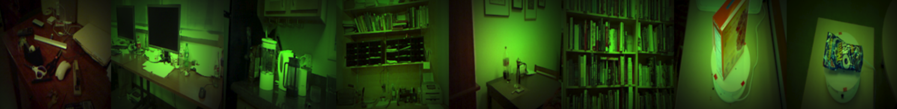
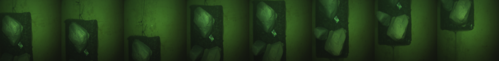
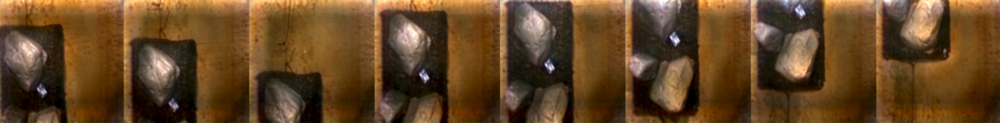

# WaterGAN Tutorial

Work in progres...



+ This repository contains source code for WaterGAN developed in [WaterGAN: Unsupervised Generative Network to Enable Real-time Color Correction of Monocular Underwater Images](https://arxiv.org/abs/1702.07392).
+ This code is modified from [Taehoon Kim's](http://carpedm20.github.io/)
  [DCGAN-tensorflow](https://github.com/carpedm20/DCGAN-tensorflow) (MIT-licensed). Our modifications are [MIT-licensed](./LICENSE).

# Usage

1) Download data:

Train a model:

```
$ python main.py --water_dataset full_water_images --air_dataset full_air_images --depth_dataset full_air_depth --input_height=640 --input_width=480 --input_water_height=1360 --input_water_width=1024 --output_height=256 --output_width=256 --is_crop=True
```

Or use our [pretrained model]().

Generate synthetic underwater images:

```

```

# Results






  
# Citations

```
@article{li2017watergan,
    author    = {Jie Li and
               Katherine A. Skinner and
               Ryan M. Eustice and
               Matthew Johnson{-}Roberson},
  title     = {WaterGAN: Unsupervised Generative Network to Enable Real-time Color
               Correction of Monocular Underwater Images},
  journal   = {CoRR},
  volume    = {abs/1702.07392},
  year      = {2017},
  url       = {http://arxiv.org/abs/1702.07392},
  timestamp = {Wed, 01 Mar 2017 14:26:00 +0100},
  biburl    = {http://dblp.uni-trier.de/rec/bib/journals/corr/LiSEJ17},
  bibsource = {dblp computer science bibliography, http://dblp.org}
}
```
